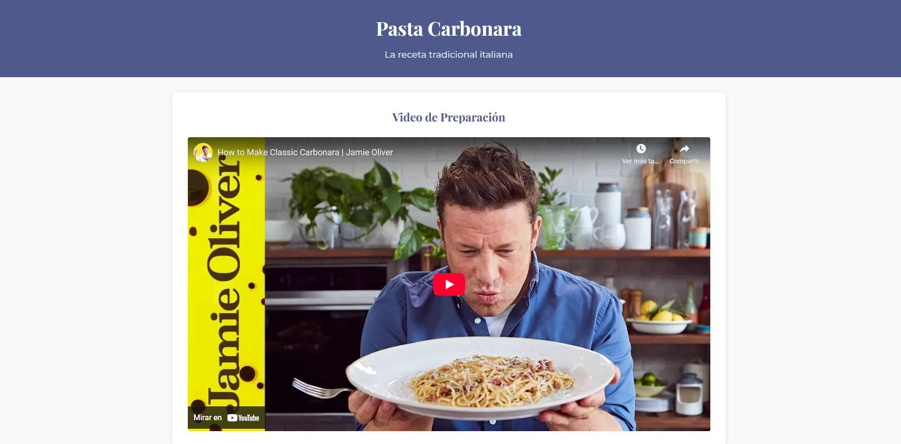

<h1 align="center"> Practica Programada 1 Fundamentos HTML5, CSS3 </h1>

¡Bienvenido/a a esta práctica programada de HTML y CSS! 👋

Este sitio web está diseñado para mostrar una receta, en este caso cómo preparar Pasta Carbonara

**v1.0**

## 📸 Imagen del proyecto

-
## 🚀 Características Principales
- **Video de su preparación:** Un video de YouTube de como se prepara la pasta carbonara.
- **Resultado final:** Una imagen del resultado final.
- **Ingredientes:** Muestra las medidas y los ingredientes que se necesitan para realizar el platillo.
- **Pasos de preparación:** Los pasos para preparar la comida.
- **Consejos del Chef:** Consejos que el chef da para la preparación de la pasta carbonara.

## ⚙️ Instalación
Sigue estos pasos para ejecutar el proyecto en tu computadora local:

1. **Clona el Repositorio:**
   ```bash
   git clone https://github.com/CarlosRW/PracticaProgramada1-Fundamentos-HTML5-CSS3.git
   cd ---

2. Abre el archivo index.html en tu navegador web.

3. (Opcional) Usar un servidor local: Si prefieres un entorno local más avanzado: Instala un servidor web como "Live Server" en Visual Studio Code (VSCode). Haz clic derecho en el archivo index.html y selecciona "Open with Live Server".

## 🛠️ Tecnologías utilizadas

<p align="center">
  
  
</p>

- **HTML5:** Estructura de la página.
- **CSS3:** Estilización de la interfaz.

¡Gracias! :heart:

---

## 👩‍💻 Autor
Carlos Eduardo Ramírez Wong.

